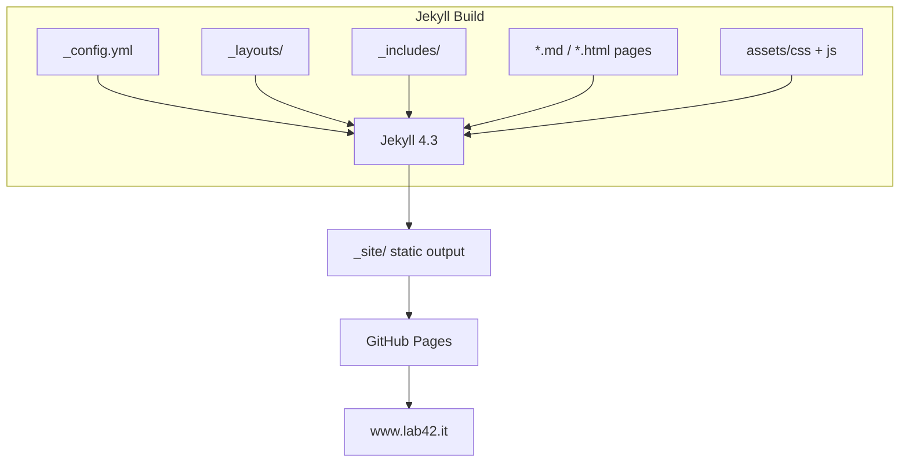

# www.lab42.it — Design Document

## Overview

Corporate website for **Lab42 srl**, an independent Italian research and consulting company founded by Alessandro Franceschi. The site presents four business units: Infrastructure/DevOps (example42), Applied AI, and Technology Media (podcasts).

Built with **Jekyll 4.3**, deployed to **GitHub Pages** via GitHub Actions on push to `main`.

Live at: [https://www.lab42.it](https://www.lab42.it)

## Architecture



This is a purely static site — no backend, no database, no JS framework. Jekyll compiles Markdown + HTML + Liquid templates into static HTML.

## Components and Interfaces

### Layouts

| File | Purpose |
|---|---|
| `_layouts/default.html` | Base HTML shell. Loads Google Fonts (Inter, JetBrains Mono), includes header/footer, injects `assets/css/main.css` + `assets/js/main.js`. Applies `class="unit-{{ page.unit }}"` to `<body>` for per-unit theming. |
| `_layouts/page.html` | Extends `default`. Used by all unit pages (example42, puppet, devops, ai, media, about). |

### Includes

| File | Purpose |
|---|---|
| `_includes/header.html` | Site navigation. Hardcoded nav links (not driven by `site.nav` in `_config.yml`). Four entries: example42, AI, Media, About. |
| `_includes/footer.html` | Site-wide footer. |

### Pages

| File | Route | Unit | Description |
|---|---|---|---|
| `index.html` | `/` | — | Homepage: hero, unit cards grid |
| `example42.md` | `/example42/` | example42 | Infrastructure unit: Puppet consulting, DevOps, open-source community |
| `puppet.md` | `/puppet/` | puppet | Puppet consulting services |
| `devops.md` | `/devops/` | devops | DevOps & cloud consulting services |
| `ai.md` | `/ai/` | ai | AI experiments: Wlaudio, Pabawi, consulting |
| `media.md` | `/media/` | media | Podcasts: La Brigata dei Geek Estinti (IT), Abnormal DevOps Iterations (EN) |
| `about.md` | `/about/` | — | Company info, values, contact |
| `cookies.md` | `/cookies/` | — | Cookie policy |
| `privacy.md` | `/privacy/` | — | Privacy policy |
| `404.html` | — | — | Custom error page |

### Assets

| File | Purpose |
|---|---|
| `assets/css/main.css` | All site styles. Per-unit color theming via `.unit-*` body classes. |
| `assets/js/main.js` | Minimal JS for interactions (nav toggle, etc.). |

### Per-Unit Theming

Pages set `unit:` in front matter. The default layout applies `class="unit-{{ page.unit }}"` to `<body>`, enabling CSS color overrides:

| Unit | Accent Color |
|---|---|
| example42, puppet | `#0097A7` |
| devops | `#0288D1` |
| ai | `#7C4DFF` |
| media | `#E64A19` |

### Navigation

Header nav: **example42**, **AI**, **Media**, **About**. The example42 link is marked active when the URL contains `/example42`, `/puppet`, or `/devops`.

### Content Patterns (CSS classes used in Markdown pages)

- `.feature-grid` / `.feature-card` — service grids
- `.chip` — technology tags
- `.project-highlight` — featured project blocks
- `.btn` / `.btn-primary` / `.btn-outline` — CTA buttons
- `.consulting-grid` / `.consulting-card` — consulting offer cards (ai.md)
- `.wlaudio-feature` — hero block for projects (ai.md)
- `.podcast-grid` / `.podcast-card` — podcast show cards (media.md)
- `.lang-badge` — language indicator on podcast cards (media.md)
- `.values-grid` / `.value-item` — values section (about.md)

## Dependencies

| Dependency | Purpose |
|---|---|
| Jekyll 4.3 | Static site generator |
| kramdown | Markdown parser |
| rouge | Syntax highlighting |
| jekyll-feed | Generates `/feed.xml` |
| jekyll-seo-tag | `` meta tags in `<head>` |
| jekyll-sitemap | Generates `/sitemap.xml` |
| Google Fonts | Inter, JetBrains Mono |

## Configuration

All in `_config.yml`:

- `title`: Lab42
- `url`: https://www.lab42.it
- `baseurl`: "" (root)
- `nav`: Array of nav items (note: header.html is hardcoded, not driven by this)
- `email`: info@lab42.it
- `github_username`: lab42
- Plugins: jekyll-feed, jekyll-seo-tag, jekyll-sitemap

## Deployment

`.github/workflows/jekyll.yml` builds with `JEKYLL_ENV=production` and deploys to GitHub Pages. Only triggers from the `main` branch.

## Common Commands

```bash
bundle install              # Install dependencies
bundle exec jekyll serve --livereload  # Local dev with live reload
bundle exec jekyll build    # Production build
bundle exec jekyll serve --drafts      # Build with drafts
```

No linter or test suite is configured.
